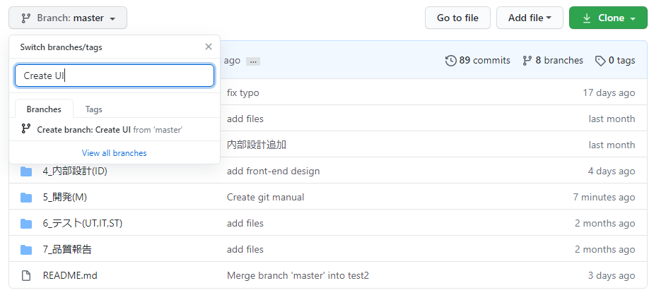

# Cách làm việc với git

## Tóm tắt
Tạo branch theo task trên github, clone repo về máy local, làm việc của task trên branch vừa tạo, kết thúc công việc thì push lên branch đó, cuối cùng là tạo pull request branch đó với master.

## Chú ý
* **Không làm việc trực tiếp cũng như push trực tiếp lên master!**
* **Khi nhiều người cùng làm việc trên 1 file sẽ phát sinh conflict khi pull request lên master. PM sẽ cũng các dev giải quyết conflict code**
* **Không clone giữa chừng hoặc sau khi làm task, rồi override lên source code! git sẽ không nhìn nhận đây là conflict và sẽ yêu cầu xóa code cũ, ghi đè code mới! Khi phát hiện trường hợp này tuyệt đối không chấp nhận pull request!**

## Câu lệnh cụ thể
(Điều kiện tiền đề: đã cài git trên máy, đã đăng kí tài khoản github và đăng nhập)
1. Tạo branch trên repo github (nên đặt tên theo nội dung công việc. Ví dụ: Create homepage)

2. Clone github repo về máy local
> git clone https://github.com/dungbong/e-learning-web-app.git
3. Làm việc trên branch riêng vừa tạo
> git checkout branch_name
4. Work, work, work from home... Happy coding
5. Sau khi hoàn thành task, add tất cả thay đổi đó vào commit, và push lên branch đó trên github
> git add .
> git commit -m "comment something here, không để trống"
> git push
6. Lên github tạo pull request
7. Đợi merge, nếu có conflict thì sửa
